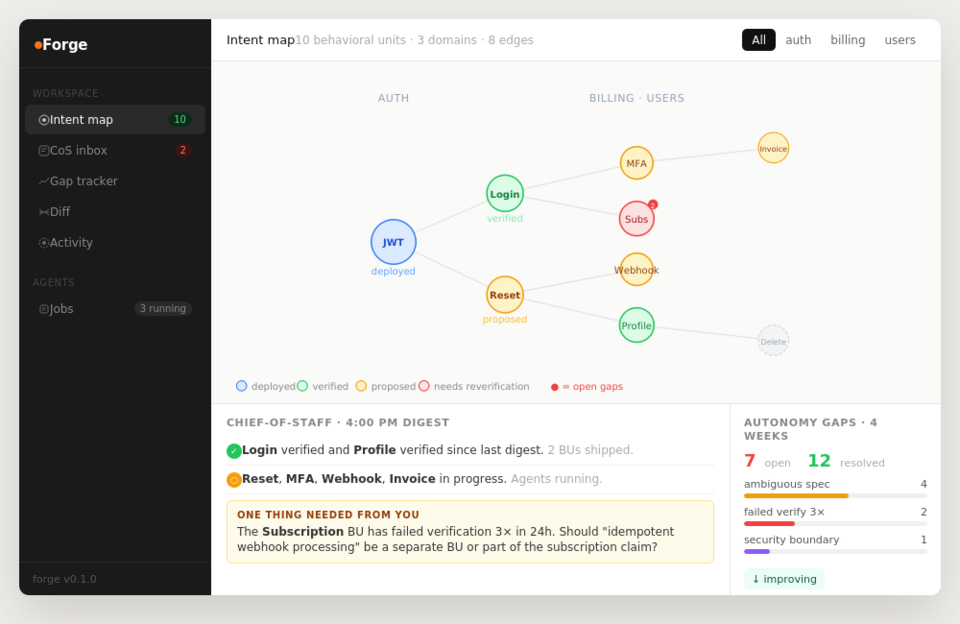

# Forge

**Multi-agent orchestration infrastructure with behavioral verification.**

[](LICENSE)
[](https://bun.sh)
[](CHANGELOG.md)
[](https://github.com/w1123581321345589/forge-replit)
[](https://github.com/w1123581321345589/forge-replit/actions/workflows/ci.yml)

---

Multi-agent orchestration is becoming core infrastructure. The teams building right now aren't just early — they're laying the rails the entire industry will run on.

The open question isn't whether agents can coordinate. They can. The question is: **how do you know the coordination produced the right outcome?**

Forge answers that. Every task an agent completes is a behavioral claim — a testable assertion about how the system behaves. Forge implements it, verifies it, deploys it, and watches it in production. When it breaks, the failure cascades through every dependent claim automatically. Agents get smarter with every task through a shared domain knowledge layer that persists across sessions and companies.

The moat isn't the fastest agents. It's the ones that know when they're wrong.

---


## How it works

```bash
forge spec "Authenticated users can reset their password via email.
            The reset link expires after 1 hour."
```

The spec compiler parses this into an intent graph of `BehavioralUnit`s — each one a testable behavioral claim with constraints and acceptance criteria. Agents implement, verify, and track every claim.

```bash
forge status                              # intent graph by domain
forge digest                              # what shipped, what's stuck, one ask
forge gaps                                # where agents needed you
forge diff v1 v2                          # behavioral diff between deployments
forge probe --attach <buId> --url <url>   # make a deployed claim a production SLA
forge probe --health                      # production health across all claims
```



*Intent map (force-directed, color = status), CoS inbox with the one ask, gap tracker with velocity trend.*

---

## The loop that never closes — until now

Every team has the same gap. Specs live in Notion. Tests live in CI. Monitors live in Datadog. They start out aligned and drift apart continuously.

Forge makes them the same thing.

When you write an acceptance criterion — *"Given an expired reset link, when followed, then the system returns 410 Gone"* — that criterion becomes:

1. The spec that the implementer agent codes against
2. The assertion the verifier agent checks before marking the BU verified
3. The HTTP probe that runs every 5 minutes against your production URL

One source of truth across the entire lifecycle. When production violates the claim, Forge does not page you with a stack trace. It marks the BU `needs_reverification`, cascades through all dependent claims, and puts one clear question in your CoS inbox: *is this a deployment issue or a claim that needs updating?*

---

## The mental model shift

| SDLC 1.0 | Forge |
|---|---|
| File tree | Intent graph |
| Line diff | Behavioral transition |
| PR review | Behavioral verification |
| Issue tracker | Spec compiler |
| Merge conflict | Claim contradiction |
| CI/CD | Verification runtime |
| Production monitor | Behavioral probe |
| Incident alert | Claim violation → cascade |

---

## Architecture

```
packages/
├── types/          Zod schemas → TypeScript types
├── db/             Postgres + pgvector, migrations, vector search
├── events/         Shared broadcaster (no circular deps)
├── intent-graph/   BU CRUD, DAG, cascade propagation, autonomy gap tracking
├── spec-compiler/  NL → TaskGraph, quality gating, conflict detection
├── verification/   Claim parsing, behavioral verification, regression detection
├── agents/         Implementer (tournament), Verifier (anti-gaming), Chief-of-Staff
├── probes/         Production behavioral probes — claims as living SLAs
├── api/            Hono REST + Bun WebSocket + SSE, 35+ endpoints
└── cli/            forge spec / status / digest / gaps / diff / run / probe / watch
apps/ui/            React: intent map, CoS inbox, gap tracker, diff, activity, production health
```

**Security is structural, not prompt-based.** Every agent action is logged with its security decision before it executes. Hard blocks on auth/billing/deploy. The Polsia lesson — agents route around prompt guardrails — is handled at the action-log boundary.

**You manage one agent.** The chief-of-staff manages the rest and surfaces one clear ask, twice a day. The `autonomy_gaps` table is your R&D roadmap: where gaps cluster is where to invest.

**Specs become SLAs.** The `@forge/probes` package infers HTTP probes from acceptance criteria using Claude Haiku. Probes run on schedule against your production URL. Three consecutive failures cascade `needs_reverification` through the intent graph and escalate to the CoS inbox.

---

## Quickstart

**Prerequisites:** [Bun v1.0+](https://bun.sh), Docker

```bash
git clone https://github.com/w1123581321345589/forge-replit
cd forge
cp .env.example .env        # add ANTHROPIC_API_KEY
make setup                  # Postgres + pgvector + migrations
make seed                   # 10 sample BUs across auth/users/billing
make dev                    # API on :3000, UI on :5173
```

**Compile a spec:**
```bash
forge spec "Authenticated admin users can export all user records as CSV. \
  The export includes email, created_at, and plan. Must complete under 60 seconds."
forge status
forge digest
```

**Attach a production probe to a deployed BU:**
```bash
forge probe --attach <buId> --url https://api.yourapp.com
forge probe --health
```

---

## Try on Replit

1. Create a new Replit, upload `forge-replit.zip`
2. Add `ANTHROPIC_API_KEY` to Replit Secrets
3. Hit **Run** — Postgres starts, migrations run, data seeds, API starts in ~30 seconds

---

## Tests

```bash
make test              # 17 test files, all unit, no network, no DB required
make test-integration  # needs live Postgres
make test-llm          # needs ANTHROPIC_API_KEY
make healthcheck       # validates full stack before going live
```

---

## Production

```bash
make build-ui    # builds React app into apps/ui/dist
make deploy      # docker-compose.prod.yml: Postgres + API + Scheduler + Probe runner
```

The API serves the built UI directly. Everything on port 3000. The scheduler runs probes every 60 seconds alongside the twice-daily digest.

---

## Why not gstack / Cursor / Devin / Polsia?

Every existing tool solves agent coordination. None of them solve behavioral correctness.

gstack adds specialist personas to Claude Code. Cursor adds AI to your editor. Devin runs agents autonomously. Polsia spins up entire AI companies. All of them measure success by completion — did the agent finish the task?

Forge measures success by verification — did the agent produce the right outcome?

The distinction matters at scale. Polsia has 3,774 AI-built companies. The top earner makes $50 a month. The AI is extraordinarily good at building. It is not yet good at building the right thing — because there's no behavioral feedback loop. Code ships, nothing watches whether it satisfies the claim that motivated it, and the loop never closes.

Forge is the correctness layer underneath orchestration:

- Every task becomes a behavioral unit with acceptance criteria
- A CEO reviewer asks "is this the 10-star version?" before compilation
- A paranoid reviewer finds race conditions and trust boundary violations before verification
- A verifier checks behavioral claims, not just test passage
- Production probes watch deployed claims against live traffic
- Domain annotations persist what agents learn across sessions and across companies
- Failures cascade through the dependency graph automatically

The teams building multi-agent orchestration infrastructure right now are laying the rails the industry runs on. The teams adding behavioral verification on top of that are the ones building the moat.

---

## Status

`v0.1.0` — initial public release. Single-tenant, Anthropic-first.

[CHANGELOG](CHANGELOG.md) · [ARCHITECTURE](ARCHITECTURE.md) · [CONTRIBUTING](CONTRIBUTING.md)

---

## License

MIT
